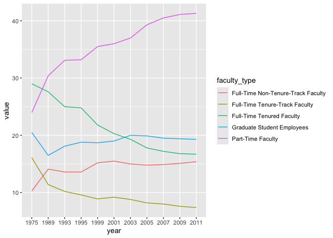
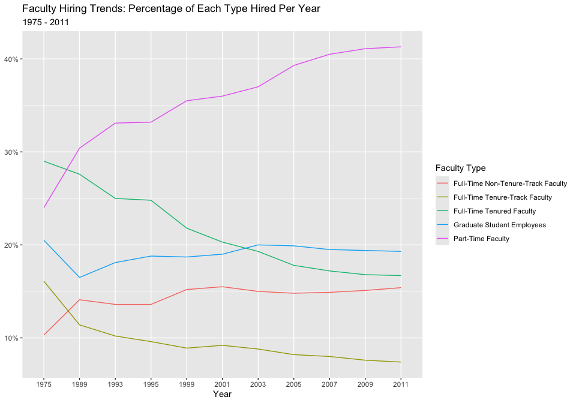
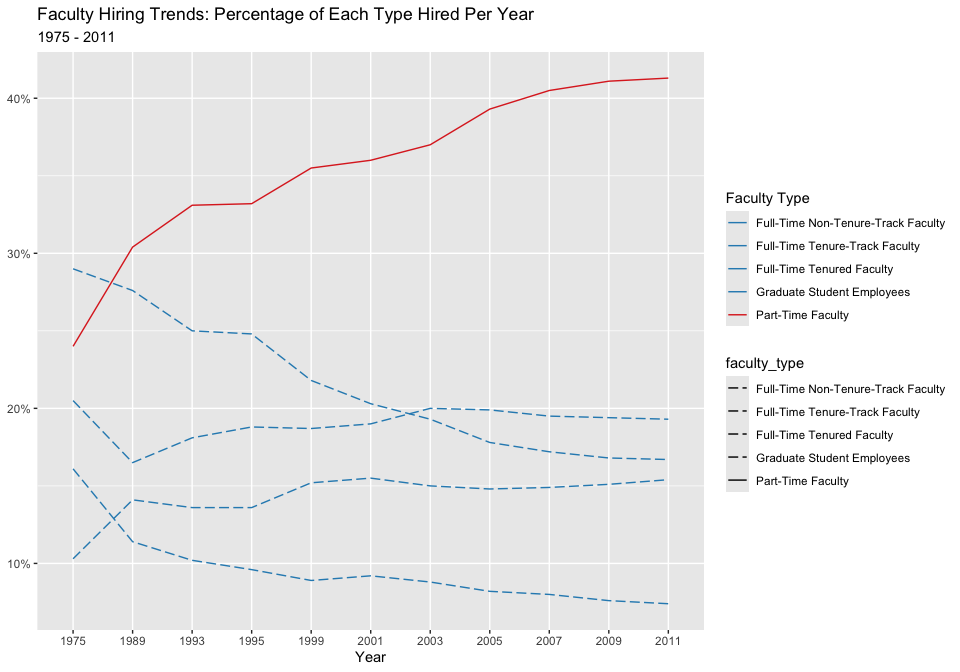
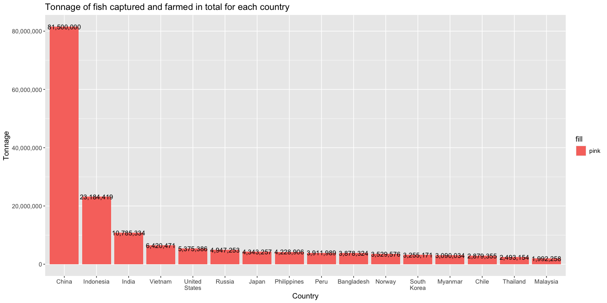
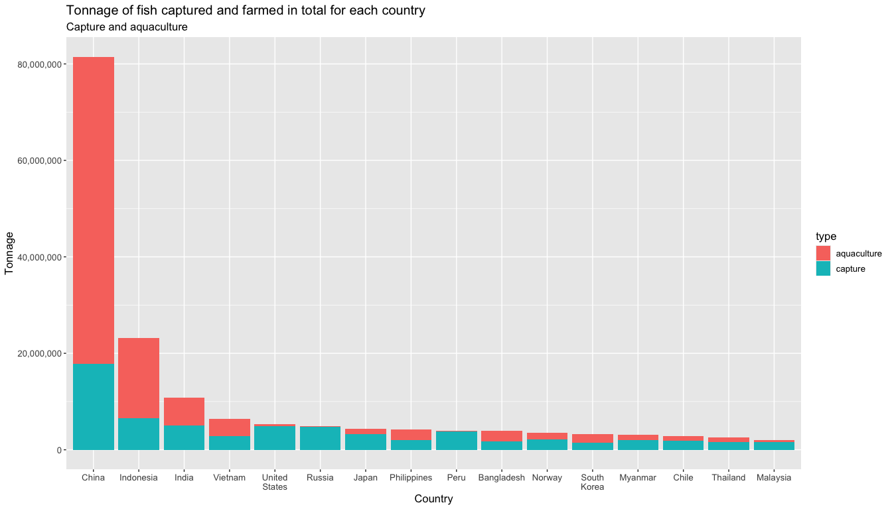
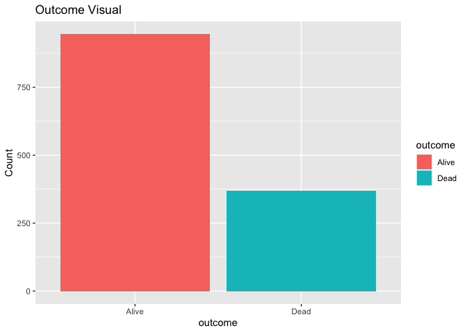
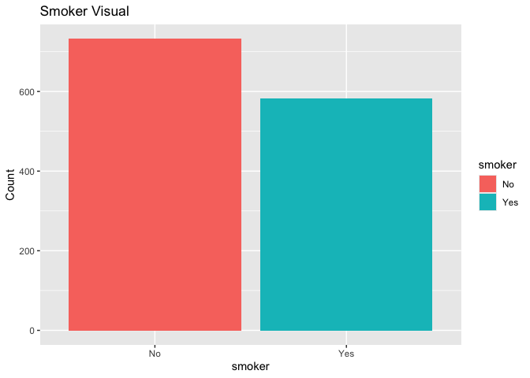
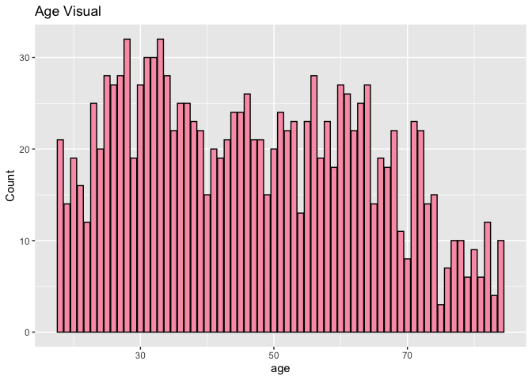
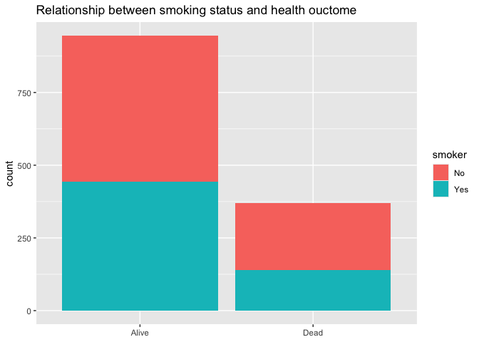
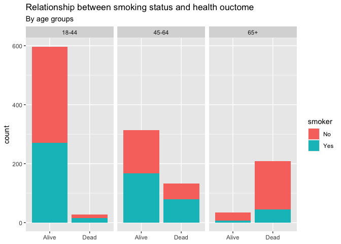

Lab 06 - Ugly charts and Simpson’s paradox
================
Fiona Wang
2025-02-25

### Load packages and data

``` r
library(tidyverse) 
library(dsbox)
library(mosaicData) 
library(scales)
library(forcats)
```

Load data

``` r
staff <- read_csv("data/instructional-staff.csv")
#reshape from wide format to long format
staff_long <- staff %>% 
  pivot_longer(cols = -faculty_type, names_to = "year") %>% 
  mutate(value = as.numeric(value))
staff_long
```

    ## # A tibble: 55 × 3
    ##    faculty_type              year  value
    ##    <chr>                     <chr> <dbl>
    ##  1 Full-Time Tenured Faculty 1975   29  
    ##  2 Full-Time Tenured Faculty 1989   27.6
    ##  3 Full-Time Tenured Faculty 1993   25  
    ##  4 Full-Time Tenured Faculty 1995   24.8
    ##  5 Full-Time Tenured Faculty 1999   21.8
    ##  6 Full-Time Tenured Faculty 2001   20.3
    ##  7 Full-Time Tenured Faculty 2003   19.3
    ##  8 Full-Time Tenured Faculty 2005   17.8
    ##  9 Full-Time Tenured Faculty 2007   17.2
    ## 10 Full-Time Tenured Faculty 2009   16.8
    ## # ℹ 45 more rows

Plot the graph

``` r
staff_long %>% 
  ggplot(aes(
    x = year,
    y = value,
    group = faculty_type,
    color = faculty_type
  )) +
  geom_line()
```

<!-- -->

### Exercise 1

``` r
staff_long %>% 
  ggplot(aes(
    x = year,
    y = value / 100,
    group = faculty_type,
    color = faculty_type
  )) +
  geom_line() +
  labs(title = "Faculty Hiring Trends: Percentage of Each Type Hired Per Year",
       subtitle = "1975 - 2011",
       x = "Year",
       y = NULL,
       color = "Faculty Type") + 
  scale_y_continuous(labels = percent_format())
```

<!-- -->

### Exercise 2

To tell the story that part-time faculty hiring has been increasing
while other faculty types have been decreasing in hiring percentages, I
think changing the colors of the lines, as well as the line types would
make this contrast stands out more.

``` r
staff_long %>% 
  ggplot(aes(
    x = year,
    y = value / 100,
    group = faculty_type,
    color = faculty_type,
    linetype = faculty_type
  )) +
  geom_line() +
  labs(title = "Faculty Hiring Trends: Percentage of Each Type Hired Per Year",
       subtitle = "1975 - 2011",
       x = "Year",
       y = NULL,
       color = "Faculty Type") + 
  scale_y_continuous(labels = percent_format()) +
  scale_color_manual(values = c(
    "Full-Time Tenured Faculty" = "#2b8cbe",
    "Full-Time Tenure-Track Faculty" = "#2b8cbe",
    "Full-Time Non-Tenure-Track Faculty" = "#2b8cbe",
    "Graduate Student Employees" = "#2b8cbe",
    "Part-Time Faculty" = "#de2d26"
  )
  ) +
  scale_linetype_manual(values = c(
    "Full-Time Tenured Faculty" = "longdash",
    "Full-Time Tenure-Track Faculty" = "longdash",
    "Full-Time Non-Tenure-Track Faculty" = "longdash",
    "Graduate Student Employees" = "longdash",
    "Part-Time Faculty" = "solid"
  ))
```

<!-- -->

``` r
# I don't know if there is a more concise way to write the code.
```

### Exercise 3

``` r
fisheries <- read_csv("data/fisheries.csv")
```

How to improve the graph? The first density plot is not very legible.
All the countries, except China, have very low frequencies. For the pie
chart, it looks pretty fancy, it’s just that I can’t tell which part is
which country.

``` r
fisheries_aqua <- fisheries %>% 
  arrange(desc(aquaculture)) %>% 
  slice(c(1:16))
fisheries_cap <- fisheries %>% 
  arrange(desc(capture)) %>% 
  slice(c(1:16))
fisheries_total <- fisheries %>% 
  arrange(desc(total)) %>% 
  slice(c(1:16))
fisheries_total %>% 
  arrange(desc(total)) %>% 
  ggplot(aes(x = reorder(country, -total), y = total, fill = "pink")) + 
  geom_col(position = "dodge") + 
  geom_text(aes(label = comma(total))) +
  scale_y_continuous(labels = comma) +
  scale_x_discrete(labels = ~str_wrap(.x, width = 10)) + 
  labs(title = "Tonnage of fish captured and farmed in total for each country",
       x = "Country",
       y = "Tonnage") +
  theme(text = element_text(size = 12.5))
```

<!-- -->

This graph here only represents the total tonnage (capture +
aquaculture).  
What I changed:  
1. I used bar plot instead of density/line plot. This is because a trend
between countries doesn’t make a lot of sense.  
2. I labeled the exact values on each bar. Because China has a very high
value, other countries have shorter bars in the graph. It’s not easy to
make sense of the value of those countries.  
3. Added labels so that it’s clear what this graph is about.  
4. Width of the graph so that it’s more readable.

One thing that could be changed: represents capture, aquaculture, and
total in the same graph.

Let’s try doing that. This will need to include what we just learned:
pivot_longer.

``` r
fisheries_long <- fisheries_total %>% 
  pivot_longer(cols = c(capture, aquaculture),
               names_to = "type",
               values_to = "tonnage") %>% 
  select(-total)

fisheries_long <- fisheries_long %>% 
  group_by(country) %>% 
  mutate(total_tonnage = sum(tonnage)) %>% 
  ungroup()

fisheries_long %>% 
  ggplot(aes(x = reorder(country, -total_tonnage), y = tonnage, fill = type)) + 
  geom_col() +
  scale_y_continuous(labels = comma) +
  scale_x_discrete(labels = ~str_wrap(.x, width = 10)) + 
  labs(title = "Tonnage of fish captured and farmed in total for each country",
       subtitle = "Capture and aquaculture",
       x = "Country",
       y = "Tonnage") +
  theme(text = element_text(size = 12.5))
```

<!-- -->

Now, this includes more information, and it makes sense.

### Stretch

``` r
library(tidyverse)
library(mosaicData)
#install.packages("performance")
library(performance)
data(Whickham)
```

### Exercise 1

I think the Wickham data is observational. Whether the participant smoke
or not and whether they remain alive or not after 20 years cannot be
manipulated.

### Exercise 2

There are 1314 observations in the data frame. All observations are
women. Each observation includes the survival status after 20 years, the
smoking status at baseline, and the age at the time of the first survey.

### Exercise 3

``` r
tibble(Whickham)
```

    ## # A tibble: 1,314 × 3
    ##    outcome smoker   age
    ##    <fct>   <fct>  <int>
    ##  1 Alive   Yes       23
    ##  2 Alive   Yes       18
    ##  3 Dead    Yes       71
    ##  4 Alive   No        67
    ##  5 Alive   No        64
    ##  6 Alive   Yes       38
    ##  7 Alive   Yes       45
    ##  8 Dead    No        76
    ##  9 Alive   No        28
    ## 10 Alive   No        27
    ## # ℹ 1,304 more rows

There are three variables in the dataset. “Outcome” is a factor variable
that includes two levels: Alive and Dead. “Smoker” is also a factor
variable with two levels: Yes and No. “Age” is an integer variable.

``` r
Whickham %>% 
  ggplot(aes(x = outcome, fill = outcome)) +
  stat_count() +
  geom_bar() +
  labs(title = "Outcome Visual",
       y = "Count")
```

<!-- -->

``` r
Whickham %>% 
  ggplot(aes(x = smoker, fill = smoker)) +
  geom_bar() +
  labs(title = "Smoker Visual",
       y = "Count")
```

<!-- -->

``` r
Whickham %>% 
  ggplot(aes(x = age)) +
  geom_bar(color = "black", fill = "#fa9fb5") +
  labs(title = "Age Visual",
       y = "Count")
```

<!-- -->

### Exercise 4

I would expect that those who said Yes in the somker column are more
likely to have “Dead” outcome after 20 years thant hose who said No.

### Exercise 5

``` r
Whickham %>% 
  count(smoker, outcome)
```

    ##   smoker outcome   n
    ## 1     No   Alive 502
    ## 2     No    Dead 230
    ## 3    Yes   Alive 443
    ## 4    Yes    Dead 139

``` r
Whickham %>% 
  ggplot(aes(x = outcome, fill = smoker)) +
  geom_bar() + 
  labs(title = "Relationship between smoking status and health ouctome",
       x = NULL)
```

<!-- -->

In the Dead outcome column, there are actually more non-smokers than
smokers. This is a surprise.  
Given the table, we can calculate four probabilities:  
Probability of dead in non-smokers = 230/732 = 31.4%.  
Probability of dead in smokers = 139/582 = 23.9%.  
Probability of smokers in Dead = 139/369 = 37.6%.  
Probability of non-smokers in Dead = 230/369 = 62.3%.  
The first two are comparable: the probability of dead is higher in
non-smokers.  
The latter two are comparable: there are more non-smoker in the dead
outcome.

### Exercise 6

``` r
Whickham <- Whickham %>% 
  mutate(age_cat = case_when(
    age <= 44 ~ "18-44", 
    age > 44 & age <= 64 ~ "45-64",
    age > 64 ~ "65+"
  ))
```

### Exercise 7

``` r
Whickham %>% 
  ggplot(aes(x = outcome, fill = smoker)) + facet_wrap(~age_cat) +
  geom_bar() + 
  labs(title = "Relationship between smoking status and health ouctome",
       subtitle = "By age groups",
       x = NULL)
```

<!-- -->

``` r
Whickham %>% 
  count(smoker, age_cat, outcome)
```

    ##    smoker age_cat outcome   n
    ## 1      No   18-44   Alive 327
    ## 2      No   18-44    Dead  12
    ## 3      No   45-64   Alive 147
    ## 4      No   45-64    Dead  53
    ## 5      No     65+   Alive  28
    ## 6      No     65+    Dead 165
    ## 7     Yes   18-44   Alive 270
    ## 8     Yes   18-44    Dead  15
    ## 9     Yes   45-64   Alive 167
    ## 10    Yes   45-64    Dead  80
    ## 11    Yes     65+   Alive   6
    ## 12    Yes     65+    Dead  44

Looking at the graph, for 18-44 age group, it doesn’t seem to matter
that much for health outcomes whether you are a smoker or not. In the
45-64 age group, smokers are more likely to have bad health outcomes
than non-smokers. In the 65+ group, non-smokers are more likely to have
bad health outcomes, yet they are also more likely to have good health
outcomes too. I think age is a very big confounding variable in the
relationship between smoking status and health outcomes.
